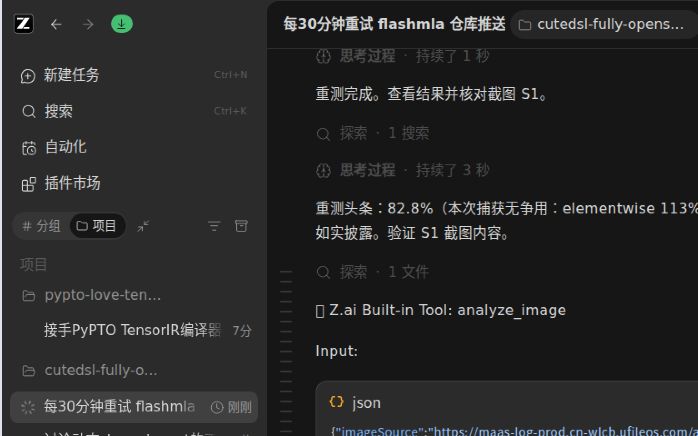
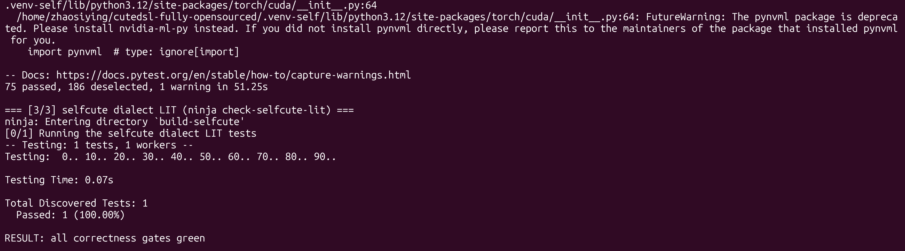
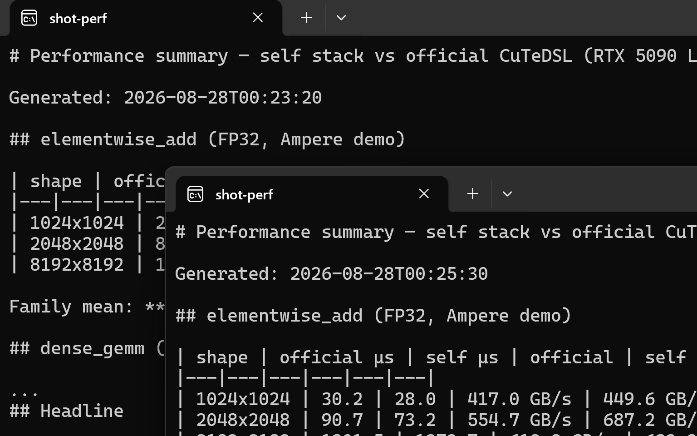

# CuTeDSL-Fully-OpenSourced

**[English](README_EN.md)**

从 Python `@cute.jit` 前端到 `sm_120a` PTX 的**完全开源** CuTeDSL 兼容编译器栈：官方 CUTLASS 示例内核与 flashinfer 算子**零修改**编译并在 RTX 5090 Laptop 上运行，全路径只由 BSD/Apache 许可的源码与我们自己的代码构成——没有 `_cutlass_ir`、没有 nvcc/NVRTC/ptxas、没有官方闭源 wheel。

在 5090 Laptop 实测中，六个具备官方 CuTeDSL 对照的算子族（逐族按 shape 取均值后再跨族算术平均）达到官方闭源实现的 **79%**（记录口径捕获 78.9%；共享 GPU 下三轮正式捕获区间 73.5%–82.8%，条件随数据记录；详见[性能总表](#5-性能)与 `artifacts/perf/summary.md`）。

> **开源边界**：从 Python API 到 textual PTX 全部开源（BSD-3）。PTX 在运行时交给 CUDA 驱动的 JIT——驱动、SASS 生成与 GPU 固件仍是 NVIDIA 专有的（与任何 CUDA 程序相同）。

## 1. 范围声明（请先读）

- **仅支持 `sm_120a`**（GeForce Blackwell / RTX 5090 系），且**仅在该 GPU 上实测**。其他架构（SM80/90/100、AMD、CPU）明确拒绝，未做任何承诺。
- 通过的算子列在[算子矩阵](#6-支持算子矩阵)；**矩阵之外的算子不承诺可编译或可运行**，泛化性工作仍在进行（见[已知限制](#8-已知限制与路线图)）。
- 我们的实现对官方算子源码**零修改**：所有修复都发生在我们自己的编译器层，绝不改算子。
- 性能数据为共享 GPU 环境下捕获（条件随每个 JSON 记录：利用率/时钟/功率）；独占 GPU 时可用 `tools/perf/run_all_perf.sh` 一键重测。

## 2. 栈结构

```
Python @cute.jit / @cute.kernel            ← 本仓库前端（AST 解释 + 部分求值）
        │  算子源码零修改（官方 demo / flashinfer）
        ▼
textual MLIR: cute / arith / scf / gpu / llvm / nvvm   ← 本仓库发射层
        │  cutegen in-process 类型 oracle（BSD，与 cute dialect 同一类型引擎）
        ▼
cutlass-compiler (BSD-3): --one-shot-convert-to-llvm
        │  --attach-nvvm-target=chip=sm_120a --emit-gpu-binary
        ▼
textual PTX (sm_120a, PTX ISA 8.7)         ← 开源 LLVM NVPTX 后端
        ▼
CUDA Driver JIT (cuModuleLoadDataEx)       ← 本仓库 runtime；全程无 ptxas
```

闭源缺口的补齐方式见[第 7 节](#7-闭源缺口的补齐)。反作弊断言：`tools/verify_open_stack.py`（官方组件不可导入、无 nvcc/ptxas/NVRTC）与 `tools/inspect_ptx.py`（PTX 目标/入口/MMA 审计）。

本机（WSL2 Ubuntu / Windows Terminal）实拍——构建、正确性、双栈性能对比：







## 3. 构建

已验证的构建路径是 Linux/WSL2 + RTX 5090。原生 Windows x64/MSVC
路径可构建宿主编译器并在没有 GPU 的情况下生成 `sm_120a` PTX；但
sm86 GPU 不能执行该 PTX。Windows 请使用 **[docs/BUILD.md](docs/BUILD.md)**
中的 PowerShell 脚本，不要运行 `.sh` 脚本。

前置依赖与逐步指南见 **[docs/BUILD.md](docs/BUILD.md)**。

### Linux/WSL2 概览

下面的 shell 命令适用于 Linux/WSL2。原生 Windows 用户请使用
`docs/BUILD.md` 中的 PowerShell 命令，不要将这些 `.venv-*` 和 Unix 路径
示例直接翻译到 Windows。

```bash
tools/build_pinned_llvm.sh        # 锁定 LLVM 23a60f15（cutlass_compiler 要求的精确版本）
tools/build_compiler.sh           # BSD cutlass_compiler + selfcute dialects
tools/cutegen_oracle/build.sh     # in-process cutegen 类型 oracle（nanobind）
tools/make_envs.sh                # .venv-reference（官方基线）/ .venv-self（本栈）
.venv-self/bin/pip install nanobind
tools/fetch_third_party.sh        # flashinfer @ 9d33a28e（verbatim 算子语料）
```

## 4. 正确性复现

```bash
tools/run_correctness.sh
```

期望输出：**261 个 pytest 用例通过，0 失败**（185 个宿主/编译器测试 + 76 个
`sm120` 测试；selfcute LIT 另行报告）。其中包含：

- 官方算子 verbatim golden：dense_gemm、blockscaled NVFP4、Ampere elementwise、flashinfer rmsnorm/add-rmsnorm/b12x MoE；
- cutegen oracle 与 cute dialect verifier 的**生成式差分护栏**（`test_layout_oracle_differential`：45 个含动态 `?` 与嵌套 mode 的布局 × 4 个代数 op，双 oracle 逐字符一致）；
- **shape-polymorphic 策略测试**（`test_dynamic_shape_policy`：被标记 tensor 的三个长度共享一份编译计划且结果精确）。

PTX 审计（可选）：`DG_DUMP_PTX=1` 跑任意负载后执行 `tools/inspect_ptx.py`。

## 5. 性能

同一份**未修改**算子源码在两个环境各跑一遍（本栈 vs 官方 `nvidia-cutlass-dsl==4.7.0` wheel），`tools/perf/run_all_perf.sh` 产出合并表格与头条均值：

| 算子族 | 官方对照 | 达到官方 |
|---|---|---|
| elementwise add（FP32，Ampere demo，3 shapes） | ✓ | 111% |
| dense GEMM（FP16，tile 64×64×64，3 shapes） | ✓ | 93% |
| blockscaled GEMM（NVFP4 coop，tile 128×128×128，3 shapes） | ✓ | 57% |
| flashinfer rmsnorm_fp4quant（3 shapes） | ✓ | 73% |
| flashinfer add_rmsnorm_fp4quant（3 shapes） | ✓ | 66% |
| flashinfer b12x fused MoE（W4A16 NVFP4，3 configs） | ✓ | 73% |
| **六族算术平均** | | **79%** |

- 完整逐 shape 数据（µs / GB/s / TFLOP·s⁻¹ / 每次捕获的 GPU 状态）：`artifacts/perf/summary.md` 与 `artifacts/perf/*.json`；
- 社区参考列（torch eager / torch.compile / cuBLAS）：`tools/perf/bench_torch_baselines.py` → `artifacts/perf/community_baselines.json`；
- FlashMLA decode（自研 sm120 warp-mma 数学核；官方 CuTeDSL 在 sm_120a 上无此算子）：1.08–2.13× vs PyTorch 参考，见 [sm120-cutedsl-flashmla](https://github.com/zhaosiying12138/sm120-cutedsl-flashmla)。

## 6. 支持算子矩阵

| 算子 | 来源（未修改，vendored commit） | 正确性 | 备注 |
|---|---|---|---|
| dense GEMM (FP16) | [CUTLASS dense_gemm.py](https://github.com/NVIDIA/cutlass/blob/main/examples/python/CuTeDSL/cute/blackwell_geforce/kernel/dense_gemm/dense_gemm.py) @ `7107b055` | golden PASS | tile 64×64×64 全 shape 矩阵 |
| blockscaled GEMM (NVFP4) | [dense_blockscaled_gemm_persistent_cooperative.py](https://github.com/NVIDIA/cutlass/blob/main/examples/python/CuTeDSL/cute/blackwell_geforce/kernel/blockscaled_gemm/dense_blockscaled_gemm_persistent_cooperative.py) @ `7107b055` | golden PASS | sv=16；sv=32（MXFP4）为已知边界 |
| elementwise add (FP32) | [elementwise_add.py](https://github.com/NVIDIA/cutlass/blob/main/examples/python/CuTeDSL/cute/ampere/kernel/elementwise/elementwise_add.py) @ `7107b055` | golden PASS | |
| rmsnorm + FP4 量化 | [flashinfer rmsnorm_fp4quant.py](https://github.com/flashinfer-ai/flashinfer/blob/main/flashinfer/cute_dsl/rmsnorm_fp4quant.py) @ `9d33a28e` | golden PASS（FP4/SF 精确） | |
| add-rmsnorm + FP4 量化 | [add_rmsnorm_fp4quant.py](https://github.com/flashinfer-ai/flashinfer/blob/main/flashinfer/cute_dsl/add_rmsnorm_fp4quant.py) @ `9d33a28e` | golden PASS | |
| b12x fused MoE（W4A16 NVFP4） | [b12x_moe.py](https://github.com/flashinfer-ai/flashinfer/blob/main/flashinfer/fused_moe/cute_dsl/b12x_moe.py) + [blackwell_sm12x/](https://github.com/flashinfer-ai/flashinfer/tree/main/flashinfer/fused_moe/cute_dsl/blackwell_sm12x) @ `9d33a28e` | golden PASS（静态/micro/动态路由） | |
| MLA decode（自研） | [sm120-cutedsl-flashmla](https://github.com/zhaosiying12138/sm120-cutedsl-flashmla) | golden PASS 4 shapes | sm120 warp-mma 改写，非 verbatim |

## 7. 闭源缺口的补齐

官方 CuTeDSL 的关键闭源件是 `_cutlass_ir`/`cute_nvgpu` 扩展与 wheel 内私有逻辑。我们的对应实现：

- **前端**：自己的 AST 解释器 + 部分求值（`python/self_cutedsl/frontend/`）——官方装饰器、嵌套 jit、动态 launch grid、编译后标量重绑定；
- **cute_nvgpu 替代**：结构化 NVVM op + `nvvm.inline_ptx` 桥（elect.sync / shfl / cp.async / TMA multicast / mbarrier 自旋等待 / setmaxnreg / mxf4nvf4 mma 等）；
- **动态 shape/layout，三层**：
  - (a) trace 期特化 + **可 opt-in 的 shape-polymorphic 策略**——`mark_layout_dynamic` 真实生效：标记维度退出特化 key、按维度注入运行时标量通道，多 shape 共享一份 PTX（对照测试见 `test_dynamic_shape_policy`）；
  - (b) 运行时标量以 SSA i32 进入 kernel ABI（动态 `scf.for` / TMA 坐标 / launch grid）；
  - (c) 对象模型路径以 `?` 动态叶子发射 cute dialect op，**类型推理由 in-process cutegen oracle 完成**——与 cute dialect 及官方闭源 `.so` 使用同一个 BSD 类型引擎，差分护栏保证与 dialect verifier 逐字符一致，单次推理 3.15ms→0.056ms（56×）；
- **TMA**：`cuTensorMapEncodeTiled` 运行时编码（绝不手写 CUtensorMap 位域）；
- **官方 wheel 仅存在于 `.venv-reference`**，只作基线对照，从不进入本栈路径。

## 8. 已知限制与路线图

- **blockscaled sv=32（MXFP4）**：死锁，诚实边界；unaligned 边界 shape 被宿主对齐预检查拒绝；
- **动态叶子身份**：cutegen 默认动态语义是匿名的（结果 `?` 全部经 property-policy 算术新建）；身份保持需要官方 `.so` 实现的 mlir_dynamic 式发射后端（约 600 行特化面）——这是闭源边界中除 tiled_mma/thrfrg 之外的另一个精确位置；本栈的动态身份由 (b) 层标量通道承担；
- **代数类型规则完全收敛**：composition/coalesce/flatten/zipped_divide/logical_divide/slice 已全走 oracle；group_modes/layout_eval 与宿主静态快路径（旗舰 verbatim 路径承重墙）待统一；
- **前端分派**：约 260 处 isinstance 链与少量 `type().__name__` 字符串分派，待按 `mma_atoms.py` 的 trait-table 模式分批重构（copy → mma → tma 族）；
- **集群**：仅 cluster (1,1,1)；多 CTA cluster / TMA multicast 机器已备未启用；
- **性能**：小 batch norm 形状与官方差距大（见 summary.md；PTX 级归因见技术报告）。

## 9. 目录结构

```
python/self_cutedsl/    前端（jit/interp/emitter/builtins）、对象模型、runtime（Driver JIT/TMA）
python/cutlass_compat/  官方 cutlass.* API 面 → 本栈的 BSD 兼容层（flashinfer 桥在此）
compiler/               selfcute dialect 骨架（ODS；生产路径未启用）
tools/                  构建/验证/基准（perf/ 与 cutegen_oracle/ 在此）
tests/                  261 项测试（verbatim golden + 差分护栏 + 策略测试）
compat/                 冻结的工具链锁与参考基线
artifacts/              性能/基线数据与 SBOM
third_party/cutlass/    vendored BSD 子树（cutlass_compiler + examples）
docs/                   BUILD.md 构建指南
```

## 10. 许可

本仓库 BSD-3-Clause。vendored 组件：CUTLASS / cutlass_compiler（BSD-3）、nanobind（BSD-3）；flashinfer 语料（Apache-2.0）按 pin 获取、不 vendored。官方闭源 wheel 仅存在于隔离的 `.venv-reference` 作基线。
